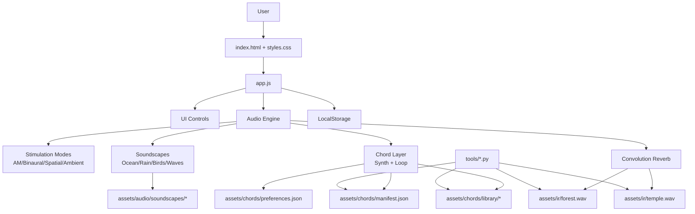

# Architecture Diagram (v2.6.0)

```mermaid
flowchart TD
  U[User] --> UI[index.html + styles.css]
  UI --> JS[app.js]

  JS --> CTRL[UI Controls]
  JS --> ENG[Audio Engine]
  JS --> PERSIST[LocalStorage]

  ENG --> MODE[Stimulation Modes\nAM/Binaural/Spatial/Ambient]
  ENG --> SCAPE[Soundscapes\nOcean/Rain/Birds/Waves]
  ENG --> CHORD[Chord Layer\nSynth + Loop]
  ENG --> IR[Convolution Reverb]

  CHORD --> MAN[assets/chords/manifest.json]
  CHORD --> PREF[assets/chords/preferences.json]
  CHORD --> LIB[assets/chords/library/*]

  IR --> IRF[assets/ir/forest.wav]
  IR --> IRT[assets/ir/temple.wav]

  SCAPE --> SFILES[assets/audio/soundscapes/*]

  TOOLS[tools/*.py] --> LIB
  TOOLS --> MAN
  TOOLS --> IRF
  TOOLS --> IRT
```
